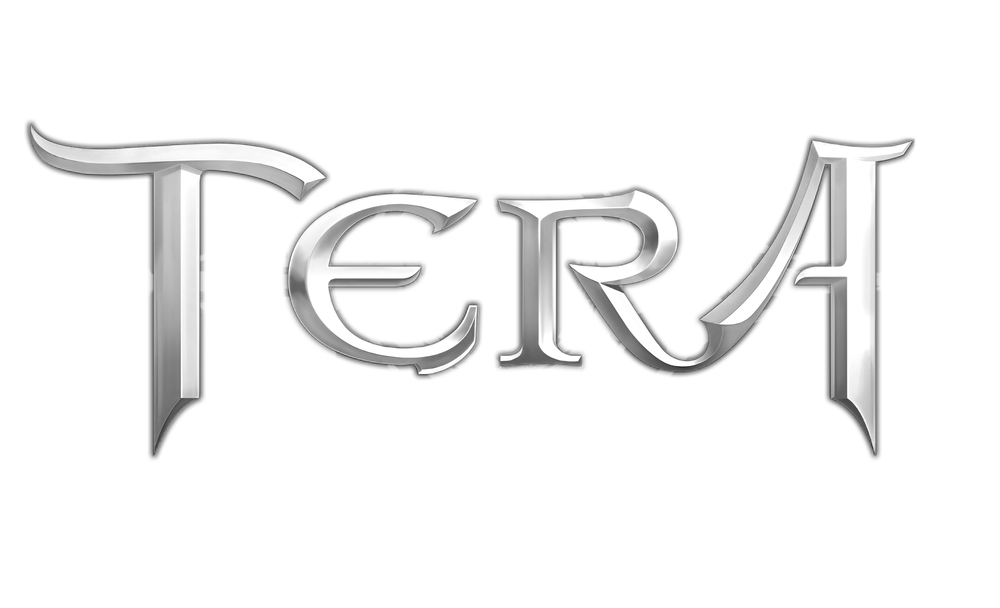

# TERA Arise

<div align="center">
    
</div>

<div align="center">

[](LICENSE-AGPL-3.0)
[](https://github.com/tera-arise/arise/commits/master)
[](https://github.com/tera-arise/arise/actions/workflows/build.yml)
[](https://discord.gg/tera-arise)

</div>

--------------------------------------------------------------------------------

**TERA Arise** is a game resurrection project for the final build of
[TERA](https://en.wikipedia.org/wiki/TERA_(video_game)) EU, 115.02 (r387486),
which was released a couple of months prior to the game's official shutdown on
June 30, 2022.

This project is still in heavy development.

## Philosophy

Unlike typical server emulation projects, TERA Arise is not trying to replicate
the original game. Rather, we are using the game client and assets as a base to
build upon, with the goal of eventually producing a better experience than the
original game. We will essentially start from scratch, with an empty data center
file, and work our way from there. Our overarching design goals are laid out on
our [GitBook space](https://design.tera-arise.io).

Once the project progresses far enough, our goal is to run official TERA Arise
servers at [tera-arise.io](https://tera-arise.io). That said, anyone is welcome
to run their own public servers, as long as the [licensing terms](#licensing)
are observed.

## Usage

Building and running TERA Arise requires the following:

* Windows 10 22H2+ or Ubuntu 22.04+
* .NET SDK 8.0.2
* PostgreSQL 16.0+

Development will typically require one of the following editors:

* Visual Studio 2022
* Visual Studio Code
* JetBrains Rider
* JetBrains Fleet

Note that you must clone the Git repository with the `--recursive` option as we
make use of submodules.

Simply run `./cake` (a [Bash](https://www.gnu.org/software/bash) script) to
build client artifacts for Windows (x64) and server artifacts for the current
platform (Windows or Linux, x64 or Arm64). This will use the `Debug`
configuration by default, which is suitable for development and debugging. Pass
`-c Release` instead to use that configuration, resulting in an optimized build.

Note that `Debug` and `Release` configurations are orthogonal to whether the
resulting artifacts are suitable for deployment; see the
[vendoring instructions](#vendoring).

You will need to set up one or more databases to run the server daemon(s). Below
is one possible way to do it which will match the expectations of the default
configuration files.

Create a user called `arise`:

```sql
CREATE USER arise PASSWORD 'arise';
```

Create a database called `arise`, owned by `arise`:

```sql
CREATE DATABASE arise OWNER 'arise' TEMPLATE 'template0' ENCODING 'utf8' ICU_LOCALE 'und' LOCALE_PROVIDER 'icu';
```

Finally, while connected to the `arise` database, create schemas for each kind
of environment:

```sql
CREATE SCHEMA development AUTHORIZATION arise;
CREATE SCHEMA production AUTHORIZATION arise;
CREATE SCHEMA staging AUTHORIZATION arise;
```

(The latter two are only required for non-development deployments.)

With this setup, and assuming you have PostgreSQL listening locally, you should
now be able to successfully do `dotnet run --project src/daemons/uniond`.

## Vendoring

In order to deploy TERA Arise in non-development scenarios, it is necessary to
set up a so-called vendor project. This project provides network certificates,
data center parameters, and more. A default vendor project intended for
development purposes is included in the [`vnd`](vnd) directory and serves as a
base for customization.

The vendor project path can be overridden by passing `--vendor <path>` to
`./cake`. The recommended setup is to have a repository with the TERA Arise
repository as a submodule, alongside a custom vendor project. A small build
script can then invoke something like
`arise/cake -c Release --vendor vendor/vendor.proj`.

Additionally, for the server daemons, an extra configuration file is required,
named either `arised.staging.json` or `arised.production.json` depending on
environment. The following is an example of a bare-bones production
configuration:

```json
{
  "Storage": {
    "ConnectionString": "Host=storage.my-tera.com; Username=arise; Password=arise; Database=production; Root Certificate=postgresql.pem; SSL Mode=VerifyCA"
  },
  "Kestrel": {
    "Certificates": {
      "Default": {
        "Path": "web.pem",
        "KeyPath": "web.key"
      }
    },
    "Endpoints": {
      "Gateway": {
        "Url": "https://my-tera.com:443"
      }
    }
  },
  "Gateway": {
    "EmailAddress": "system@my-tera.com",
    "SendGridKey": "<SendGrid API key>"
  },
  "Game": {
    "Endpoints": [
      "0.0.0.0:7801",
      ":::7801"
    ]
  }
}
```

If you intend to run the separate gateway and game daemons rather than the union
daemon, you can also include the service name in the file name:
`arise-gatewayd.json`, `arise-gamed.staging.json`, etc.

## Licensing

Server emulation for online games has traditionally suffered from bad actors
taking and modifying the open source code, running for-profit servers, and then
contributing nothing back to the project. To combat this, TERA Arise is licensed
under the [GNU Affero General Public License 3.0](LICENSE-AGPL-3.0). This means
that anyone running TERA Arise *must* provide the full source code of the client
and server components to users.

To be clear, this license only applies to TERA Arise itself; the original TERA
game client and its assets are not subject to it.

## Development

For development purposes, you will likely want to make some adjustments to the
default submodule setup:

* `git submodule foreach git checkout master`: Switch all submodules from
  detached `HEAD` to tracking the actual branch. Without this, commits made in
  submodules might be lost.
* `git submodule foreach git fetch --unshallow`: Make available the entire
  history of all submodules. Without this, tools like `git log` and `git blame`
  will be largely useless.

Additionally, to verify commit signatures from other authors, you may wish to
add this to your `.git/config` file (or similar):

```gitconfig
[gpg.ssh]
    allowedSignersFile = allowed_signers
```
